# Paystream AI

AI-powered payroll automation platform built for the AI Genesis Hackathon.

## Overview

Paystream AI eliminates manual payroll processing by combining artificial intelligence with blockchain technology. The platform enables instant USDC payments to employees through natural language commands, voice input, and automated workflows.

**Built by:** Hausor Labs
**Blockchain:** Arc Testnet
**Demo:** [https://pay-stream.vercel.app](https://pay-stream.vercel.app)

---

## Problem Statement

Traditional payroll systems are:

- **Slow** - 3-5 business days for payment processing
- **Expensive** - 3-5% transaction fees
- **Manual** - Hours of data entry and reconciliation
- **Limited** - Restricted to banking hours
- **Error-prone** - Human mistakes in calculations

---

## Solution

Paystream AI automates payroll end-to-end:

- **Instant Payments** - USDC transfers in seconds on Arc blockchain
- **AI Assistant** - Natural language payroll queries and commands
- **Semantic Search** - Find employees by skills, not just keywords
- **Voice Control** - Hands-free payroll management
- **Document Processing** - Auto-extract data from IDs and forms
- **Workflow Automation** - AI-powered approval routing

---

## Technology Stack

### Frontend
- Next.js 16 with App Router
- React 18
- Tailwind CSS
- shadcn/ui components

### AI & Machine Learning
- Google Gemini 2.0 Flash (multimodal AI)
- Groq LLaMA 3.3 70B (fast inference)
- Qdrant Vector Database (semantic search)
- Opus API (workflow automation)
- ElevenLabs (voice AI)

### Blockchain & Payments
- Arc Blockchain (USDC transfers)
- Circle Developer Wallets
- Ethers.js
- Solidity smart contracts

### Backend
- Supabase PostgreSQL
- Clerk Authentication
- AI/ML API model router

---

## Architecture

### System Flow

```
┌─────────────────────────────────────────────────────┐
│                   User Interface                     │
│              (Next.js + React + Tailwind)           │
└──────────────┬──────────────────────────────────────┘
               │
               ▼
┌─────────────────────────────────────────────────────┐
│                  Penny AI Agent                      │
│         (Orchestration & Intent Analysis)           │
└──────┬────────┬──────────┬──────────┬───────────────┘
       │        │          │          │
       ▼        ▼          ▼          ▼
   ┌────────┐ ┌────────┐ ┌────────┐ ┌────────┐
   │ Gemini │ │  Groq  │ │Qdrant  │ │  Opus  │
   │  2.0   │ │ LLaMA  │ │ Vector │ │Workflow│
   └────────┘ └────────┘ └────────┘ └────────┘
```

### Data Flow

```
┌─────────────────────────────────────────────────────┐
│              Employee Data Storage                   │
└──────────────┬──────────────────────────────────────┘
               │
       ┌───────┴───────┐
       ▼               ▼
┌─────────────┐  ┌─────────────┐
│  Supabase   │  │   Qdrant    │
│ PostgreSQL  │  │   Vectors   │
│  (Primary)  │  │  (Search)   │
└─────────────┘  └─────────────┘
```

---

## API Integration Flow Charts

### 1. Google Gemini 2.0 Integration

```mermaid
graph TD
    A[User Input] --> B{Input Type}
    B -->|Text Query| C[Gemini Text Analysis]
    B -->|Document Upload| D[Gemini Vision OCR]
    B -->|Voice Recording| E[Gemini Audio Transcription]

    C --> F[Generate Embedding]
    D --> G[Extract Document Data]
    E --> H[Convert to Text]

    F --> I[Store in Qdrant]
    G --> J[Populate Form Fields]
    H --> K[Process as Text Query]

    I --> L[Return Results]
    J --> L
    K --> L
```



**Implementation:**
- Text embeddings for semantic search (768 dimensions)
- Vision API for document OCR (ID cards, invoices, W-2 forms)
- Audio API for voice transcription
- Multimodal understanding for context-aware responses

**Files:**
- `src/lib/gemini.ts` - Gemini client configuration
- `src/services/embeddings.ts` - Text embedding generation
- `src/app/api/scan/document/route.ts` - Document OCR endpoint
- `src/app/api/audio/transcribe/route.ts` - Voice transcription endpoint

---

### 2. Qdrant Vector Database Integration


**Implementation:**
- Two collections: `employees_knowledge` and `conversations_memory`
- 768-dimensional embeddings from Gemini
- Cosine similarity scoring
- Automatic fallback to Supabase if unavailable

**Files:**
- `src/lib/qdrant.ts` - Qdrant client
- `src/services/vector-search.ts` - Search logic
- `src/app/api/employees/search/route.ts` - Search endpoint
- `scripts/init-qdrant-collections.ts` - Setup script

---

### 3. Arc Blockchain Payment Flow


**Smart Contract:**
```solidity
contract BatchPayer {
    function batchTransferUSDC(
        address[] calldata recipients,
        uint256[] calldata amounts
    ) external;
}
```

**Contract Address:** `0x7bf4790186099b66ddAC855938ebF766D121289d`
**USDC Address:** `0x75faf114eafb1BDbe2F0316DF893fd58CE46AA4d`
**Network:** Arc Testnet
**RPC URL:** `https://rpc.testnet.arc.network`

**Files:**
- `contracts/BatchPayer.sol` - Smart contract
- `src/services/blockchain.ts` - Web3 integration
- `src/app/api/payroll/route.ts` - Payroll execution endpoint
- `src/lib/arc-rpc.ts` - Arc RPC provider

---

### 4. Circle Wallet Integration


**Implementation:**
- Automatic wallet creation for new employees
- Entity secret management for wallet control
- Support for both auto-generated and custom wallet addresses
- Secure key storage using Circle's encryption

**Files:**
- `src/lib/circle.ts` - Circle API client
- `src/app/api/employees/route.ts` - Employee creation with wallet
- `src/app/api/onboard/route.ts` - CSV import with wallet creation

---

### 5. Opus Workflow Integration


**Workflow Decision Logic:**
- Auto-approve transactions under $10,000 threshold
- AI validation using dual models (Gemini + Groq)
- Compliance checks for fraud detection
- Complete audit trail with provenance tracking

**Files:**
- `src/lib/opus.ts` - Opus API client
- `src/app/api/workflows/reviews/route.ts` - Workflow execution
- `src/app/api/payroll/route.ts` - Payroll with workflow approval

---

### 6. Complete Payroll Execution Flow


---

## Key Features

### Penny AI Assistant

Natural language interface for payroll operations.

**Capabilities:**
- Text queries: "Show me all blockchain developers"
- Voice commands: "What's our total monthly payroll?"
- Document scanning: Upload ID cards for auto-extraction
- Context memory: Remembers previous conversations

**Tech:**
- Groq LLaMA 3.3 70B for intent analysis
- Gemini 2.0 for multimodal understanding
- Qdrant for conversation memory

### Semantic Employee Search

Find employees by skills and expertise, not exact keywords.

**Example:**
- Query: "blockchain developers"
- Matches: "Senior Blockchain Developer", "Web3 Engineer", "Smart Contract Developer"

**Tech:**
- Gemini text-embedding-004 (768 dimensions)
- Qdrant vector similarity search
- Relevance scoring: High (>0.7), Medium (0.5-0.7), Low (<0.5)

### Instant Blockchain Payments

Execute payroll in seconds instead of days.

**Process:**
1. Select employees for payment
2. Review total USDC amount
3. Click "Run Payroll"
4. Payments execute on Arc blockchain
5. Receive transaction confirmation

**Benefits:**
- Near-instant settlement
- Transaction fees < $0.01
- 24/7 payment processing
- Transparent on-chain records

### Document OCR

Auto-extract data from documents using Gemini Vision.

**Supported:**
- ID cards (driver's license, passport)
- Invoices
- Receipts
- W-2 tax forms

**Tech:**
- Google Gemini 2.0 Flash Vision
- Confidence scoring
- Supports: PNG, JPEG, WebP, HEIC, HEIF

### Voice Control

Three voice input modes for hands-free operation.

**Modes:**
1. Live Voice - Continuous recognition with auto-send
2. Recording - Capture audio clips for transcription
3. Browser Speech - Web Speech API fallback

**Tech:**
- ElevenLabs API for transcription
- AI/ML API for speech-to-text
- Gemini for audio analysis

---

## Installation

### Prerequisites

- Node.js 18+
- npm or yarn
- Supabase account
- API keys (see Environment Variables)

### Setup

```bash
# Clone repository
git clone https://github.com/Hausor-Labs-Official/paystream-ai.git
cd paystream-ai

# Install dependencies
npm install

# Set up environment variables
cp .env.example .env.local
# Add your API keys to .env.local

# Initialize Qdrant collections (optional)
npx tsx scripts/init-qdrant-collections.ts

# Seed demo data
npx tsx scripts/seed-demo-data.ts

# Start development server
npm run dev
```

Visit http://localhost:3000

---

## Environment Variables

Create a `.env.local` file with the following:

```bash
# Database
NEXT_PUBLIC_SUPABASE_URL=your_supabase_url
SUPABASE_SERVICE_ROLE_KEY=your_supabase_key

# Google Gemini
GEMINI_API_KEY=your_gemini_key

# Qdrant Vector Database
QDRANT_URL=your_qdrant_url
QDRANT_API_KEY=your_qdrant_key

# Groq
GROQ_API_KEY=your_groq_key

# Circle
CIRCLE_API_KEY=your_circle_key

# Arc Blockchain
ARC_RPC_URL=https://rpc.testnet.arc.network
DEPLOYER_PRIVATE_KEY=your_private_key
NEXT_PUBLIC_USDC_ADDRESS=0x75faf114eafb1BDbe2F0316DF893fd58CE46AA4d
NEXT_PUBLIC_BATCH_PAYER_ADDRESS=0x7bf4790186099b66ddAC855938ebF766D121289d

# ElevenLabs
ELEVENLABS_API_KEY=your_elevenlabs_key

# Opus
OPUS_API_KEY=your_opus_key

# Clerk
NEXT_PUBLIC_CLERK_PUBLISHABLE_KEY=your_clerk_key
CLERK_SECRET_KEY=your_clerk_secret
```

---

## API Endpoints

### Employee Management

```
GET    /api/employees          - List all employees
POST   /api/employees          - Create employee (auto-creates wallet)
GET    /api/employees/:id      - Get employee details
PUT    /api/employees/:id      - Update employee
DELETE /api/employees/:id      - Delete employee
GET    /api/employees/search   - Semantic search
```

### Payroll

```
POST   /api/payroll            - Execute batch payroll
GET    /api/balance            - Check USDC balance
GET    /api/wallet/transactions - Transaction history
```

### AI Features

```
POST   /api/penny              - Penny AI assistant
POST   /api/scan/document      - Document OCR
POST   /api/audio/transcribe   - Voice transcription
```

### Onboarding

```
POST   /api/onboard            - CSV bulk import
```

### Workflows

```
POST   /api/workflows/reviews  - Create approval workflow
```

---

## Smart Contract

The BatchPayer contract enables efficient multi-recipient USDC transfers.

**Deployment:**
```bash
npx tsx scripts/deploy-batch-payer.ts
```

**Contract:**
```solidity
// SPDX-License-Identifier: MIT
pragma solidity ^0.8.20;

import "@openzeppelin/contracts/token/ERC20/IERC20.sol";

contract BatchPayer {
    function batchTransferUSDC(
        address usdcToken,
        address[] calldata recipients,
        uint256[] calldata amounts
    ) external {
        require(recipients.length == amounts.length, "Length mismatch");

        IERC20 usdc = IERC20(usdcToken);

        for (uint256 i = 0; i < recipients.length; i++) {
            require(
                usdc.transferFrom(msg.sender, recipients[i], amounts[i]),
                "Transfer failed"
            );
        }
    }
}
```

**Deployed Address:** `0x7bf4790186099b66ddAC855938ebF766D121289d`

---

## Database Schema

### Employees Table

```sql
CREATE TABLE employees (
  id UUID PRIMARY KEY DEFAULT uuid_generate_v4(),
  name TEXT NOT NULL,
  email TEXT UNIQUE NOT NULL,
  salary_annual NUMERIC NOT NULL,
  wallet_address TEXT NOT NULL,
  pay_status TEXT DEFAULT 'pending',
  created_at TIMESTAMPTZ DEFAULT NOW()
);
```

### Payments Table

```sql
CREATE TABLE payments (
  id UUID PRIMARY KEY DEFAULT uuid_generate_v4(),
  employee_id UUID REFERENCES employees(id),
  amount NUMERIC NOT NULL,
  currency TEXT DEFAULT 'USDC',
  tx_hash TEXT,
  block_number INTEGER,
  status TEXT DEFAULT 'pending',
  created_at TIMESTAMPTZ DEFAULT NOW()
);
```

---

## Performance

### Benchmarks

- **Payroll Processing:** < 30 seconds (vs. 3-5 days traditional)
- **Transaction Fees:** < 0.1% (vs. 3-5% traditional)
- **Semantic Search:** < 3 seconds average
- **Document OCR:** < 5 seconds per document
- **Voice Transcription:** < 2 seconds

### Scalability

- **Concurrent Users:** Supports 1000+ simultaneous users
- **Batch Payments:** Up to 100 employees per transaction
- **Database:** PostgreSQL with connection pooling
- **Blockchain:** Arc network handles 100+ TPS

---

## Security

- Clerk authentication with session management
- Supabase Row-Level Security (RLS)
- Environment variable isolation
- API key rotation support
- Circle wallet encryption
- Smart contract auditing
- HTTPS/TLS encryption

---

## Testing

```bash
# Run all tests
npm test

# Test specific API
npx tsx scripts/test-payroll.ts

# Check Arc blockchain balance
npx tsx scripts/check-balance.ts
```

---

## Deployment

### Vercel (Recommended)

```bash
# Install Vercel CLI
npm install -g vercel

# Deploy
vercel --prod
```

### Environment Variables

Add all environment variables to Vercel dashboard under Settings > Environment Variables.

---

## Hackathon Submission

### AI Genesis Hackathon Challenges

**1. Google Gemini Challenge**
- Multimodal AI for text, vision, and audio
- Document OCR for payroll documents
- Semantic search with embeddings
- Natural language query processing

**2. Opus Challenge**
- Enterprise workflow approvals
- AI-powered compliance validation
- Automated decision routing
- Complete audit trail

**3. Qdrant Challenge**
- Vector-based employee search
- Conversation memory
- Semantic similarity matching
- Real-time search performance

---

## License

MIT License

Copyright (c) 2025 Hausor Labs

---

## Contact

**Built by:** Hausor Labs
**Website:** https://pay-stream.vercel.app
**Repository:** https://github.com/Hausor-Labs-Official/paystream-ai

---

## Acknowledgments

AI Genesis Hackathon sponsors:
- Google Gemini
- Opus by Applied AI
- Qdrant
- Arc Blockchain
- Circle
